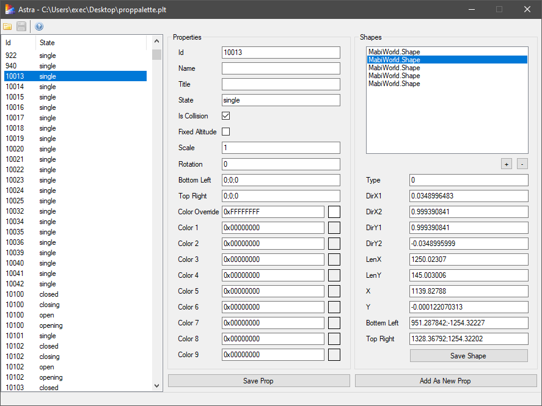
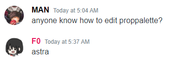

Astra
=============================================================================

A simple editor for Mabinogi's Prop Palette files (.plt). I did this mostly
for fun and have only tested the basic functionality. Should you notice any
issues, please report them on the GitHub repository.

The Prop Palette is a collection of prop information used by the client
and the servers, mostly for dynamically spawned props. Astra makes it easy
to modify this informatioin in a graphical interface. 

Usage
-----------------------------------------------------------------------------

After opening a .plt file, select a prop from the list to modify it. The
list shows the prop ids and their states, since some props have multiple
entries, for different states.

The properties are relatively straight forward and can simply be modified.
The shapes are a list of rectangles that make up a prop's shape, which is
used for collision detection or events. You can remove shapes by selecting
one and pressing Delete or the "-" button. New shapes can be added by
pressing the "+" button. If you select and modify a shape, clicking
"Save Shape" will save the change, otherwise it will be reverted once a
different shape or prop is selected.

Once all changes have been made to a prop, clicking "Save Prop" will save
the changes, while clicking "Add As New Prop" will essentially create a copy
of the selected prop, with the modified information. If neither button is
clicked, the changes are reverted if a new prop gets selected.

To remove a prop from the file, select it on the left and press the Delete
key.

Finally, to save all changes to the file that's currently open, click the
"Save" button in the toolbar.

Preview
-----------------------------------------------------------------------------

Inspiration
-----------------------------------------------------------------------------

Links
-----------------------------------------------------------------------------

- GitHub: https://github.com/exectails/Astra
